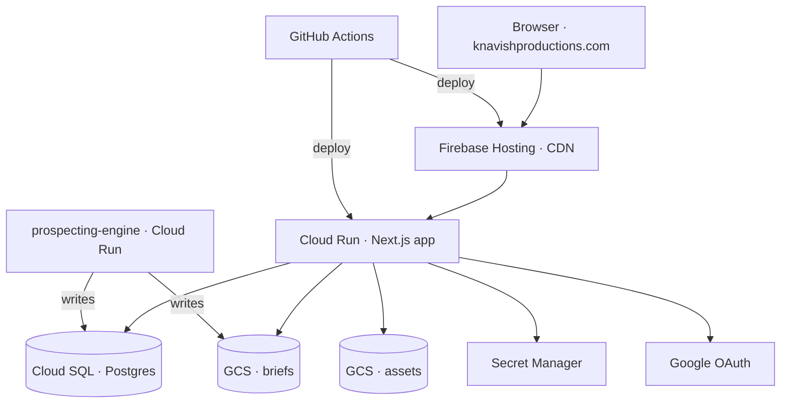

# knavishproductions-app

Production pipeline app for the [KnavishMantis](https://youtube.com/@knavishmantis) YouTube channel. Live at [knavishproductions.com](https://knavishproductions.com). Next.js + Postgres on Cloud Run + Firebase Hosting.

> Source is private. This README is the public-facing architecture writeup.

Closes the loop on the channel's content pipeline: takes validated briefs from [prospecting-engine](https://github.com/knavishmantis/prospecting-engine-public), runs them through scripting, asset handoff to paid editors, and payment tracking. Replaces a scattered toolchain (one tool per stage) with a single app where shorts move through the workflow end-to-end.

Six modules behind a single Next.js App Router app:

1. **Brief inbox** — consumes briefs from `prospecting-engine`.
2. **Script editor** — Tiptap-based editor; brief → filmable script.
3. **Asset manager** — reusable clip + world-preset library.

   

4. **Editor handoff** — public `/apply` intake (with anti-spam) → packages script + assets for a paid editor.

   

5. **Payment tracker** — pay-per-short accounting against the handoff stream.
6. **Teardown** — annotations on Minecraft shorts so the channel's style is reusable.

   

**Stack:** Next.js (App Router) · TypeScript · Drizzle ORM · PostgreSQL · NextAuth (Google) · Tiptap · shadcn/ui · TanStack Query · Cloud Run · Firebase Hosting · Terraform · GitHub Actions.
